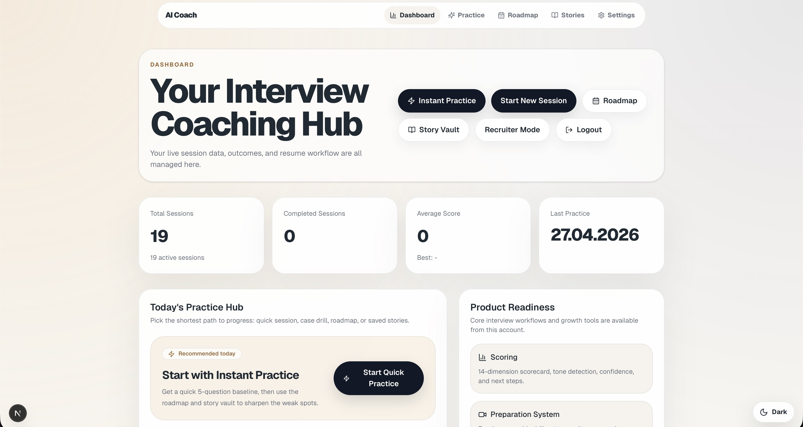
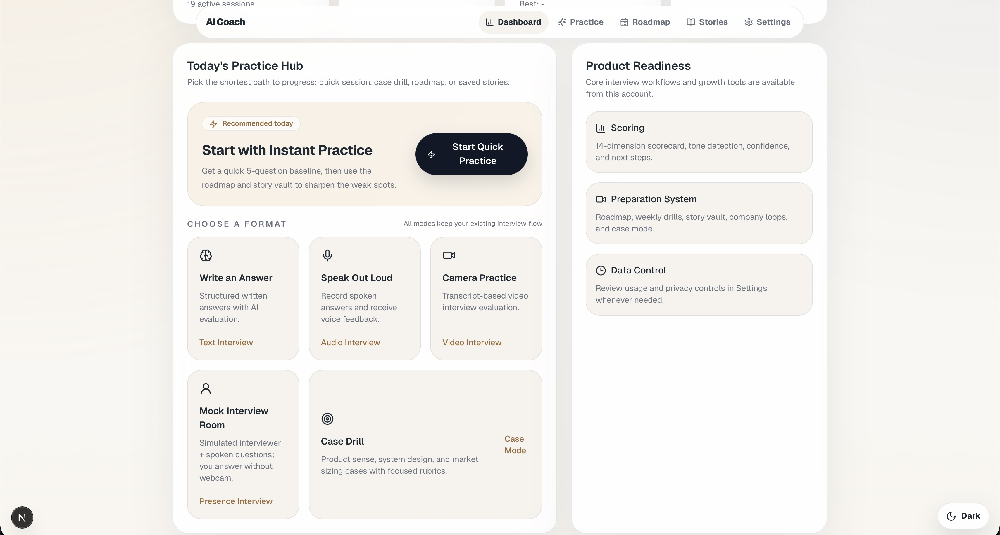
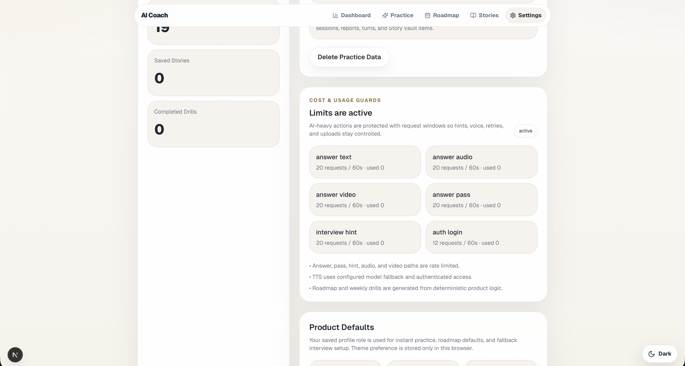

# AI Interview Coach

CV ve hedef role gore yapay zeka destekli mulakat simulasyonu sunan full-stack web uygulamasi.

## Problem ve hedef kitle

**Kim:** Junior developer'lar, yeni mezunlar ve global is pazarina hazirlanan adaylar.  
**Problem:** Gercekci mulakat pratigi yapamiyorlar, kisisel geri bildirim alamiyorlar ve performanslarini objektif olcemiyorlar.  
**Cozum:** CV + role gore dinamik mulakat, LLM tabanli skorlama ve RAG destekli geri bildirim — *"Gercek mulakatin provasini yap ve nerede elenecegini ogren."*

## Canli linkler

| | URL |
|--|-----|
| **Uygulama** | https://ai-coach-frontend-bouv.onrender.com |
| **API** | https://ai-coach-backend-4ph0.onrender.com |
| **API docs (OpenAPI)** | https://ai-coach-backend-4ph0.onrender.com/docs |
| **Health check** | https://ai-coach-backend-4ph0.onrender.com/health |

Monorepo: **FastAPI** backend + **Next.js** frontend — mock interview, skorlama ve AI kocluk.

## Deploy (Render)

1. Repoyu GitHub'a bagla, Render'da **Blueprint** ile [`render.yaml`](render.yaml) deploy et.
2. Backend env: `OPENAI_API_KEY`, `CORS_ORIGINS=https://ai-coach-frontend-bouv.onrender.com`
3. Frontend env: `NEXT_PUBLIC_API_BASE=https://ai-coach-backend-4ph0.onrender.com`
4. Her iki servisi redeploy et; health check → `{"ok":true}`

Detay: [DEPLOYMENT.md](DEPLOYMENT.md) · Env sablonlari: [.env.example](.env.example), [backend/.env.example](backend/.env.example), [frontend/.env.example](frontend/.env.example)

## Dokumantasyon (teslim)

| Dokuman | Aciklama |
|---------|----------|
| [PRD.md](PRD.md) | Problem, hedef kullanici, MVP kapsami |
| [Plan.md](Plan.md) | Kullanici hikayeleri ve teknik adimlar |
| [tech-stack.md](tech-stack.md) | Teknolojiler ve AI kullanimi |
| [DesignSystem.md](DesignSystem.md) | Renk, tipografi, bilesen kurallari |
| [Progress.md](Progress.md) | Gelistirme gunlugu ve kararlar |
| [prodocs/](prodocs/) | AI ajan / gelistirici referanslari |
| [DEPLOYMENT.md](DEPLOYMENT.md) | Production deploy notlari |

## Screenshots

### Home


### Dashboard



### Practice Hub



### Interview Setup


### Roadmap


### Settings



## Project Structure

| Path | Role |
|------|------|
| [`frontend/`](frontend/) | Next.js + React + TypeScript web UI (App Router) |
| [`backend/`](backend/) | FastAPI API, auth, interview engine, RAG, rate limits |
| [`screenshots/`](screenshots/) | README ekran goruntuleri |
| [`docs/OPERATIONS.md`](docs/OPERATIONS.md) | Operations checklist |

## Prerequisites

- Python 3.10+ and `pip`
- Node 18+ and npm
- OpenAI (or configured provider) API keys as in `backend/.env.example`

## Quick Start

From repository root:

```bash
# Backend API (default http://127.0.0.1:8000)
make run-backend

# Frontend (default http://127.0.0.1:3000)
make run-frontend
```

Or manually in two terminals:

```bash
cd backend && python3 -m venv .venv && source .venv/bin/activate
pip install -r requirements.txt && cp .env.example .env
uvicorn app.main:app --reload
```

```bash
cd frontend && npm install && cp .env.example .env
npm run dev
```

Set `NEXT_PUBLIC_API_BASE` in `frontend/.env.local` if the API is not on port 8000.

### Backend Health Endpoints

- `GET /health`
- `GET /health/live`
- `GET /health/ready`

## Architecture (short)

- **Auth**: JWT in JSON + **HttpOnly** cookie; responses include a **stateless CSRF token** (`csrf_token`) — send `X-CSRF-Token` on authenticated **POST/PUT/PATCH/DELETE**. `GET /auth/me` for session checks.
- **Interview flow**: sessions and turns in SQLAlchemy/SQLite (default); answers evaluated via LLM + purpose-built RAG (`backend/app/interview_evaluation.py`, `rag.py`).
- **RAG layer**: Chroma + OpenAI embeddings power answer evaluation, question generation context, hints, CV role-fit evidence, roadmap/drills, Story Vault semantic rerank, final report evidence, and RAG-vs-no-RAG comparison. Multi-collection RAG: `role_kb`, `company_kb`, `question_kb`, `answer_kb`, `cv_kb`, `evaluation_kb`, `roadmap_kb`, `user_memory_kb`, plus a lightweight Graph-RAG relation layer. Ingest docs with `cd backend && python3 scripts/ingest_kb.py`.
- **Personal coaching memory**: Interview answers and CV analysis create private `user_memory_items` signals. Later hints/questions/evaluations retrieve these signals for personalization.
- **RAG observability**: `GET /rag/inspector/session/{id}` returns query debug info, evidence layers, graph hits, memory signals, retrieval quality, and faithfulness/coverage proxy metrics.
- **Quality signals**: methodology: `backend/docs/EVALUATION_METHODOLOGY.md`; golden score bands: `backend/data/golden_scoring_benchmark.json`. CI runs deterministic gates + golden JSON validation.
- **CV**: PDF text via `pypdf`; keyword + OpenAI embedding fusion; section detection; optional LLM screening.

## API discovery

- **Canli OpenAPI:** https://ai-coach-backend-4ph0.onrender.com/docs
- **Lokal:** http://127.0.0.1:8000/docs (backend calisirken)

## Tests & CI

```bash
make test
make typecheck
make lint
cd frontend && npm run test:e2e
```

CI: **pytest**, **`ci_evaluation_gate.py`**, **`ci_golden_file.py`**, **mypy**, frontend **lint**. Workflow: `.github/workflows/ci.yml`.
